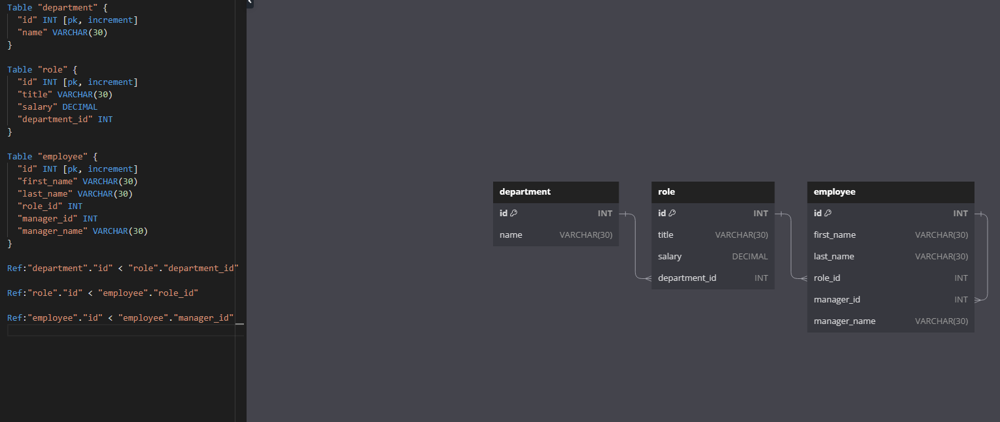
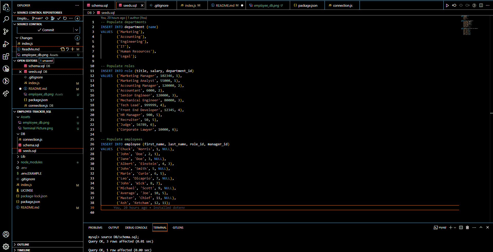

# Employee Tracker SQL


   
## Description 
A command-line application used to manage a company's employee database, using Node.js, Inquirer, and MySQL.
  
## Table of Contents
* [Installation](#installation)
* [Usage](#usage)
* [Screenshot](#screenshot)
* [License](#license)
* [Contributing](#contributing)
* [Questions](#questions)
    
 ## Installation 

This application requires ```npm install``` for the installtion of inquirer.js, mySQL, console.table and dotenv
Users will be required to change the .env.EXAMPLE to .env with their associated mySQL password
  
## Usage 
This application will allow users to manage the database of a company (employee_db) using 
 ```node index.js```

## Screenshot
Screenshot of the terminal running Employee Tracker


Database schema


Gif


## Screen Castify
https://drive.google.com/file/d/17ZRW91rz1T6W4p1tDqdqzjsQqoz65B1P/view
  
## License 
This project is licensed under MIT
  
## Contributing 
Brian Trang
With thanks to USYD
    
## Questions
If you have any questions about this project, please contact me directly at brian.trang9@gmail.com . Feel free to view more of my projects at https://github.com/MakeRedundant.
